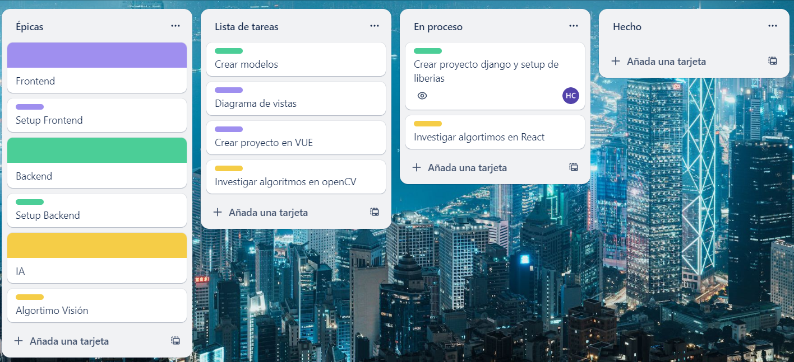

# Metodología de trabajo

- Inove proveerá del repositorio del proyecto, al cual los interesados en aportar en el serán agregados como colaboradores.
- Dentro de este repositorio se deberá crear una carpeta para cada fin (ej: backend, frontend, ia)
- Se deberá realizar el análisis de los objectos y la documentación de este repositorio a fin de armar un desglose de tareas en pequeños objetivos.
- El desplogese de épicas, tareas (task) y bugs se llevará en un tablero de kanbar (ej: trello)
- Cada tarea que se reailice será trabajada en un branch por una única persona (cada persona es responsable de una tarea y una rama).
- Una tarea debe representar un esfuerzo no mayor a una semana de trabajo (~ 6horas)
- Una tarea estará asignada a una persona cuando esta está en progreso (mientras no esté en progreso no estará asignada a nadie)
- En caso de que el responsable no pueda cumplicar con su objetivo semanal (la task), deberá desasignarse de la tarea para que otra persona la pueda tomar
- No es necesario tener el degloce de todas las tareas de una épicas, a medida que avanza el proyecto se va creando las tareas (completar el backlog) según como resultó el avance del último mes. Lo importante es que haya suficiente tareas para todos los miembros que quieran participar ese mes.

- La rama main estará protegida, para poder subir cambios se deberá realizar un PullRequest (PR) de la rama en la cual se trabajo la tarea.
- Para que un PR pueda ser mergeado a main, deberá ser revisado y aprobado por otra persona del equipo.
- Finalizada la tarea y mergeada a main, se debe crear una nueva branch para trabajar en una nueva task.

- Se presentará en el discord un reporte mensual de avanza de las tareas completadas, compartiendo el link del kanban.